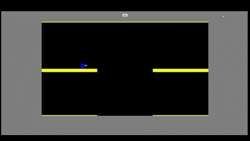
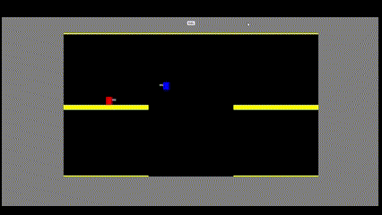
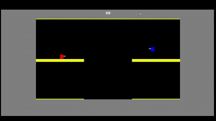

Djoust is a web-based multiplayer game influenced by the arcade classic Joust. It is developed with vanilla JavaScript for the frontend and Node.js, Express, and Socket.IO libraries handling the backend functionalities. 
The primary goal is to create a lightweight, anonymous multiplayer experience while learning about full stack application development. This application is currently alpha stage of development.

Latest developments:
Established game environment with server authoritative state updates.
  Client side handles rendering gameplay and emitting movement commands to the server.
  Server handles receiving movement and network commands from the client and emits modified player state at a fixed interval, currently 64 tick, via websocket connection.

Duel Start:

Collision detection between players and their weapons:

weapon collision with platform:

Future Development Roadmap:

minimize influence of network latency on game frame rendering. 
  last test with ngrok tunnel went as expected.
  Network latency is noticeably sluggish and making the game run smoothly on network is the biggest hurdle before deployment. 

Improve UX between single player and duel states.

expand single player experience. 
  Add bots and visually track player bot kills and player deaths. 

Acquire a domain and figure out the best platform for cloud hosting. 

Explore user authorization and build a database for retaining user sessions and statistics. 
  Create a live leaderboard. 
  Allow users to create custom duel rooms for private matches. 
